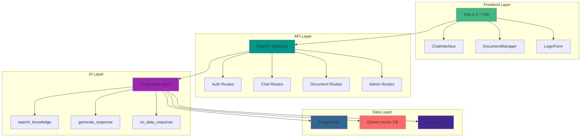

# 🤖 Gemelo Digital - Agustín Modia

<div align="center">

**Una aplicación conversacional de IA que crea un gemelo digital de Agustín Modia con capacidades avanzadas de procesamiento de documentos y búsqueda semántica.**

*Desarrollado para el Santex Challenge*

[](https://fastapi.tiangolo.com/)
[](https://vuejs.org/)
[](https://postgresql.org/)
[](https://qdrant.tech/)
[](https://docs.docker.com/compose/)
[](https://openai.com/)

[🚀 Instalación](#-instalación-rápida) • [📖 Documentación](#-documentación) • [🎯 Características](#-características-principales) • [🏗️ Arquitectura](#️-arquitectura)

</div>

---

## 🎯 Características Principales

### 🤖 **Gemelo Digital Inteligente**
- **Personalidad Auténtica**: Replica la personalidad y conocimientos de Agustín Modia
- **RAG Avanzado**: Retrieval-Augmented Generation con base de conocimientos vectorial
- **Streaming en Tiempo Real**: Respuestas instantáneas con Server-Sent Events

### 📄 **Procesamiento Inteligente de Documentos**
- **Upload de PDFs**: Interfaz drag-and-drop con progreso en tiempo real
- **Chunking Semántico**: Segmentación inteligente preservando contexto
- **Búsqueda Vectorial**: text-embedding-3-large (3072 dimensiones) para máxima precisión

### 💬 **Chat Conversacional Avanzado**
- **Historial Persistente**: PostgreSQL para almacenamiento de conversaciones
- **Contexto Inteligente**: Mantiene el contexto entre sesiones
- **Fuentes Citadas**: Referencias automáticas a documentos utilizados

### 🔐 **Seguridad y Autenticación**
- **JWT Authentication**: Sistema de tokens seguros
- **Sesiones Protegidas**: Rutas protegidas con middleware
- **Configuración Segura**: Variables de entorno para credenciales

### 📊 **Visualización del Workflow**
- **Diagrama LangGraph**: Visualización interactiva del flujo del agente
- **Modal Interactivo**: Exploración del workflow en tiempo real
- **SVG Dinámico**: Generación automática del diagrama del agente

---

## 🏗️ Arquitectura



### 🔄 Flujo de Datos

1. **Usuario** → Interface Vue.js (Puerto 3000)
2. **Frontend** → API FastAPI (Puerto 8000)
3. **API** → LangGraph Agent
4. **Agent** → Búsqueda Vectorial (Qdrant 6333) + Historial (PostgreSQL 5432)
5. **Agent** → OpenAI API (LLM + Embeddings)
6. **Respuesta** ← Streaming SSE al usuario

---

## 🔧 Stack Tecnológico

### Frontend
| Tecnología | Versión | Propósito |
|------------|---------|-----------|
| **Vue.js** | 3.x | Framework progresivo y reactivo |
| **Vite** | Latest | Build tool ultra-rápido |
| **Axios** | Latest | Cliente HTTP con interceptors |
| **Marked** | Latest | Renderizado Markdown |
| **Highlight.js** | Latest | Syntax highlighting para código |

### Backend
| Tecnología | Versión | Propósito |
|------------|---------|-----------|
| **FastAPI** | 0.104+ | Framework web async de alto rendimiento |
| **LangGraph** | Latest | Orquestación de agentes conversacionales |
| **SQLAlchemy** | Latest | ORM para PostgreSQL |
| **PyPDF2** | Latest | Procesamiento y extracción de texto PDF |
| **python-jose** | Latest | JWT authentication y autorización |

### AI & Embeddings
| Servicio | Modelo | Propósito |
|----------|--------|-----------|
| **OpenAI LLM** | gpt-4o-mini | Generación de respuestas conversacionales |
| **OpenAI Embeddings** | text-embedding-3-large | Vectorización semántica (3072 dims) |
| **Qdrant** | Latest | Base de datos vectorial de alto rendimiento |

### Infrastructure
| Tecnología | Versión | Propósito |
|------------|---------|-----------|
| **PostgreSQL** | 15-alpine | Base de datos relacional para historial |
| **Docker** | Latest | Containerización de microservicios |
| **Docker Compose** | v3.8 | Orquestación multi-contenedor |

---

## 🚀 Instalación Rápida

### Prerequisitos
```bash
# Verificar instalación de Docker
docker --version
docker-compose --version

# Si no están instalados:
curl -fsSL https://get.docker.com -o get-docker.sh && sh get-docker.sh
```

### 1. Clonar y Configurar
```bash
# Clonar el repositorio
git clone <repository-url>
cd gemelo-digital

# Configurar variables de entorno
cp .env.example .env
# ⚠️ IMPORTANTE: Editar .env con tu OPENAI_API_KEY
```

### 2. Configuración del .env
```bash
# ==============================================
# CONFIGURACIÓN ESENCIAL
# ==============================================
OPENAI_API_KEY=sk-proj-tu-clave-api-aqui     # ⚠️ REQUERIDA
OPENAI_MODEL=gpt-4o-mini

# ==============================================
# BASES DE DATOS (Configuración por defecto)
# ==============================================
POSTGRES_HOST=postgres
POSTGRES_DB=gemelo_digital
POSTGRES_USER=admin
POSTGRES_PASSWORD=admin123

QDRANT_HOST=qdrant
QDRANT_PORT=6333
COLLECTION_NAME=gemelo_agustin_large

# ==============================================
# AUTENTICACIÓN (Cambiar en producción)
# ==============================================
ADMIN_USER=admin-gd
ADMIN_PASSWORD=Pasado_por_mail
SECRET_KEY=8f42b85e741d819...
```

### 3. Levantar la Aplicación
```bash
# 🚀 Construir y levantar todos los servicios
docker-compose up --build

# 🔧 En background (detached mode)
docker-compose up -d --build

# 📋 Ver logs en tiempo real
docker-compose logs -f
```

### 4. Verificar Servicios
| Servicio | URL | Estado |
|----------|-----|---------|
| **Frontend** | http://localhost:3000 | 🎨 Interfaz principal |
| **Backend API** | http://localhost:8000/docs | 📚 Documentación Swagger |
| **Qdrant Dashboard** | http://localhost:6333/dashboard | 🔍 Base vectorial |
| **PostgreSQL** | localhost:5432 | 🗄️ Base relacional |

---

## 🎮 Uso de la Aplicación

### 🔐 **Acceso al Sistema**
1. Navega a **http://localhost:3000**
2. Usa las credenciales:
   - **Usuario**: `admin-gd`
   - **Contraseña**: `Pasado_por_mail`

### 💬 **Chat Conversacional**
- **Pestaña "Chat"**: Conversación en tiempo real con el gemelo
- **Streaming**: Respuestas instantáneas palabra por palabra
- **Historial**: Carga conversaciones anteriores con "Cargar Historial"
- **Fuentes**: Documentos citados se muestran bajo cada respuesta
- **Limpieza**: Botón "Limpiar" para borrar historial completo

### 📄 **Gestión de Documentos**
- **Pestaña "Entrenar Gemelo"**: Subida y gestión de PDFs
- **Drag & Drop**: Arrastra PDFs directamente a la interfaz
- **Progreso**: Barra de progreso en tiempo real
- **Lista**: Visualiza documentos procesados con metadata
- **Eliminación**: Gestiona documentos individualmente

### 📊 **Visualización del Workflow**
- **Botón "Grafo"**: Junto a "Entrenar Gemelo"
- **Modal Interactivo**: Visualización SVG del agente LangGraph
- **Flujo Completo**: START → Search → Decision → Response → END

---

## 🧠 Sistema de Agentes LangGraph

### 🔄 Workflow del Agente

```
┌─────────┐
│  START  │ ← Usuario envía mensaje
└────┬────┘
     ▼
┌──────────────────┐
│ search_knowledge │ ← SIEMPRE busca en vectores
│ (RAG Obligatorio)│
└────────┬─────────┘
         ▼
    ┌──────────────┐
    │ ¿Encontró     │ ← Decisión inteligente
    │ información  │   Score > 0.2
    │ relevante?   │
    └──────┬───────┘
           ▼
    ┌──────────────────────────┐
    ▼                          ▼
┌──────────────────┐  ┌─────────────────┐
│ generate_response│  │ no_data_response│
│ (Con contexto    │  │ (Mensaje        │
│  RAG)           │  │  estándar)      │
└─────────┬────────┘  └────────┬────────┘
          ▼                     ▼
         ┌─────────────────────────┐
         │         END             │ ← Respuesta al usuario
         └─────────────────────────┘
```

### 🎯 Características del Agente

- **Always-RAG**: Toda consulta busca en la base de conocimientos
- **Priorización CV**: Los documentos de CV/resume tienen prioridad
- **Streaming**: Generación de respuesta en tiempo real
- **Contexto**: Mantiene historial de conversación
- **Fallback**: Respuesta coherente cuando no hay datos

---

## 🗄️ Base de Datos

### PostgreSQL - Historial de Chat
```sql
-- Tabla principal de mensajes
CREATE TABLE chat_messages (
    id SERIAL PRIMARY KEY,
    user_message TEXT NOT NULL,
    assistant_response TEXT NOT NULL,
    timestamp TIMESTAMP DEFAULT CURRENT_TIMESTAMP,
    session_id VARCHAR DEFAULT 'default'
);
```

### Qdrant - Base de Datos Vectorial
```python
# Configuración de colección
{
    "vector_size": 3072,        # text-embedding-3-large
    "distance": "Cosine",       # Métrica de similitud
    "collection": "gemelo_agustin_large"
}

# Estructura de documentos
{
    "vector": [3072 dimensiones],
    "payload": {
        "text": "Contenido del chunk",
        "metadata": {
            "file_name": "documento.pdf",
            "chunk_id": 0,
            "document_type": "resume|general",
            "page_number": 1
        }
    }
}
```

---

## 🐳 Microservicios Docker

### Servicios y Puertos

| Servicio | Puerto | Imagen | Volumen | Dependencias |
|----------|--------|--------|---------|--------------|
| **postgres** | 5432 | postgres:15-alpine | postgres_data | - |
| **qdrant** | 6333/6334 | qdrant/qdrant:latest | qdrant_data | - |
| **backend** | 8000 | ./backend/Dockerfile | uploads_data | postgres, qdrant |
| **frontend** | 3000 | ./frontend/Dockerfile | - | backend |

### Health Checks
- **PostgreSQL**: `pg_isready -U admin -d gemelo_digital`
- **Qdrant**: `curl -f http://localhost:6333/healthz`
- **Backend**: Endpoint `/docs` disponible
- **Frontend**: HTTP 200 en puerto 3000

---

## 🔧 Desarrollo Local

### Backend (sin Docker)
```bash
cd backend
pip install -r requirements.txt
uvicorn app.main:app --reload --host 0.0.0.0 --port 8000
```

### Frontend (sin Docker)
```bash
cd frontend
npm install
npm run dev
```

### Comandos Útiles
```bash
# 📋 Ver logs por servicio
docker-compose logs -f backend
docker-compose logs -f frontend
docker-compose logs postgres
docker-compose logs qdrant

# 🔄 Reiniciar servicios
docker-compose restart backend
docker-compose restart frontend

# 🗂️ Limpiar y rebuild
docker-compose down -v  # ⚠️ Borra volúmenes
docker-compose up --build --no-cache

# 💾 Backup PostgreSQL
docker-compose exec postgres pg_dump -U admin gemelo_digital > backup.sql

# 🔄 Reset colección Qdrant
curl -X POST http://localhost:8000/api/admin/reset_collection \
  -H "Authorization: Bearer <tu-token>"
```

---

## 🛠️ API Endpoints

### 🔐 Autenticación
| Método | Endpoint | Descripción |
|--------|----------|-------------|
| POST | `/api/auth/login` | Login con JWT |
| GET | `/api/auth/verify` | Verificar token |
| GET | `/api/auth/test` | Health check |

### 💬 Chat
| Método | Endpoint | Descripción |
|--------|----------|-------------|
| POST | `/api/chat/send` | Enviar mensaje (no-streaming) |
| POST | `/api/chat/stream` | Enviar mensaje (streaming SSE) |
| GET | `/api/chat/history` | Obtener historial |
| DELETE | `/api/chat/history` | Limpiar historial |

### 📄 Documentos
| Método | Endpoint | Descripción |
|--------|----------|-------------|
| POST | `/api/documents/upload` | Subir PDF |
| GET | `/api/documents/list` | Listar documentos |
| GET | `/api/documents/detail` | Metadata detallada |
| DELETE | `/api/documents/{filename}` | Eliminar documento |

### ⚙️ Admin
| Método | Endpoint | Descripción |
|--------|----------|-------------|
| POST | `/api/admin/reset_collection` | Resetear Qdrant |
| GET | `/api/admin/metadata` | Metadata de documentos |
| GET | `/api/admin/langgraph-svg` | Diagrama del workflow |

---

## 🔧 Troubleshooting

### Problemas Comunes

#### 🚫 Error OpenAI API
```bash
# Verificar clave API
echo $OPENAI_API_KEY
curl -H "Authorization: Bearer $OPENAI_API_KEY" https://api.openai.com/v1/models
```

#### 🔴 Qdrant no inicia
```bash
# Ver logs
docker-compose logs qdrant
# Limpiar volúmenes
docker-compose down -v && docker-compose up --build
```

#### 🔴 PostgreSQL connection refused
```bash
# Verificar estado
docker-compose ps postgres
docker-compose logs postgres
```

#### 🌐 Frontend no conecta
```bash
# Verificar CORS
docker-compose logs backend | grep CORS
# Test de conectividad
docker-compose exec frontend ping backend
```

### Performance Tips

#### PostgreSQL Optimization
```sql
-- postgresql.conf
shared_buffers = 256MB
effective_cache_size = 1GB
maintenance_work_mem = 64MB
```

#### Resource Limits
```yaml
# docker-compose.yml
services:
  backend:
    deploy:
      resources:
        limits:
          memory: 2G
          cpus: '1.0'
```

---

## 📖 Documentación

📚 **Documentación Completa**: Ver [`documentacion.md`](./documentacion.md) para documentación técnica exhaustiva que incluye:

- 🏗️ Arquitectura detallada del sistema
- 🔧 Configuración avanzada de componentes
- 🎨 Guía de desarrollo frontend y backend
- 🧠 Funcionamiento interno del agente LangGraph
- 🗄️ Esquemas de base de datos
- 🚀 Guías de despliegue en producción
- 🔐 Configuraciones de seguridad
- 📊 Monitoring y métricas

---

## 📊 Métricas de Performance

### KPIs Objetivo
- **Response Time**: <200ms para queries simples
- **Vector Search**: <500ms para búsquedas semánticas  
- **Document Processing**: ~30s por documento PDF
- **Concurrent Users**: Hasta 100 usuarios simultáneos
- **Uptime**: 99.9% con health checks automáticos

### Monitoring
- **Health Checks**: Automáticos cada 30s
- **Auto Restart**: Políticas de reinicio en fallos
- **Logs Centralizados**: Docker logs agregados
- **Resource Monitoring**: CPU, memoria, disco

---

## 🔒 Seguridad

### 🛡️ Características de Seguridad
- **JWT Authentication**: Tokens seguros con expiración
- **Environment Variables**: Credenciales nunca hardcodeadas  
- **CORS Configuration**: Orígenes permitidos configurables
- **Input Validation**: Validación de uploads y queries
- **Rate Limiting**: Protección contra abuso de API

### 🔐 Configuración de Producción
```bash
# Generar claves seguras
SECRET_KEY=$(openssl rand -hex 32)
POSTGRES_PASSWORD=$(openssl rand -base64 32)
ADMIN_PASSWORD=$(openssl rand -base64 16)

# Configurar firewall
ufw allow 80/tcp      # HTTP
ufw allow 443/tcp     # HTTPS
ufw deny 5432/tcp     # PostgreSQL (solo interno)
ufw deny 6333/tcp     # Qdrant (solo interno)
```

---

## 🤝 Contribución

### Estructura de Desarrollo
```bash
# Crear rama de feature
git checkout -b feature/nueva-funcionalidad

# Desarrollo con hot reload
docker-compose up --build

# Tests y validación
npm run test          # Frontend
pytest               # Backend

# Pull request
git push origin feature/nueva-funcionalidad
```

### Estándares de Código
- **Frontend**: ESLint + Prettier
- **Backend**: Black + isort + flake8
- **Commits**: Conventional Commits
- **Documentation**: JSDoc + Docstrings

---

## 📝 Licencia

Este proyecto es **privado y confidencial** - Desarrollado para el Santex Challenge.

---

<div align="center">

**🤖 Gemelo Digital - Powered by AI**

*Desarrollado con ❤️ para el Santex Challenge*

[⬆️ Volver al inicio](#-gemelo-digital---agustín-modia)

</div>